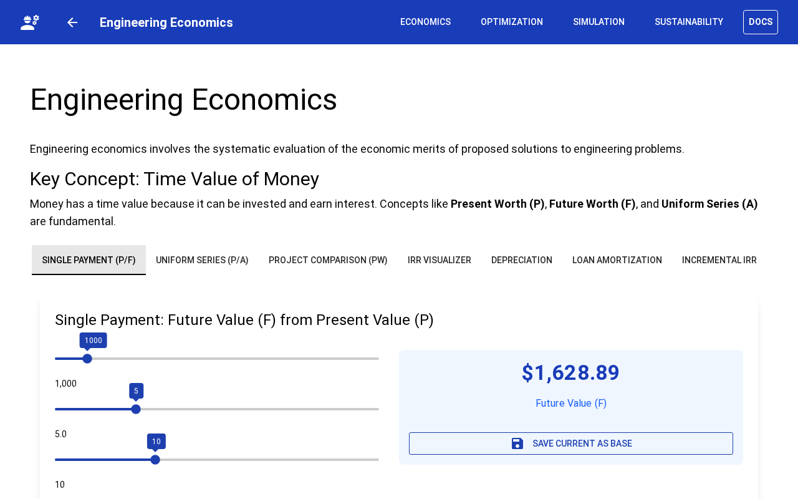
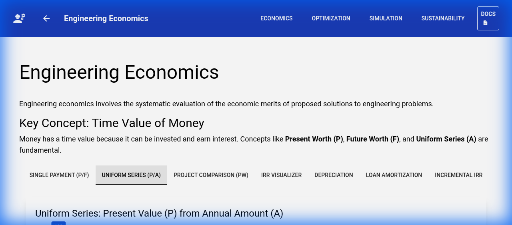
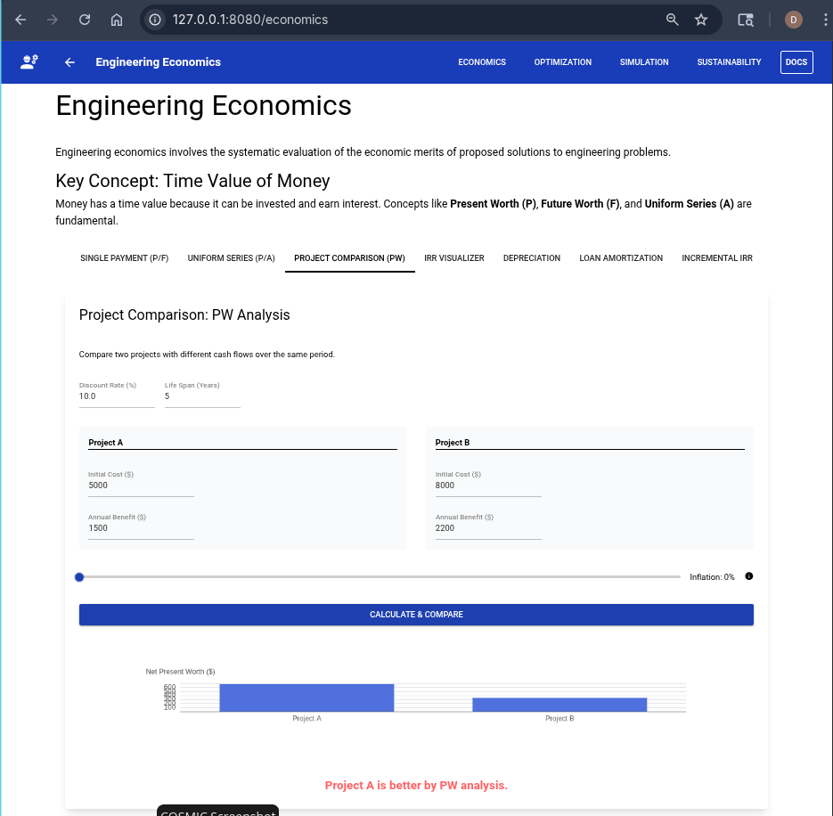
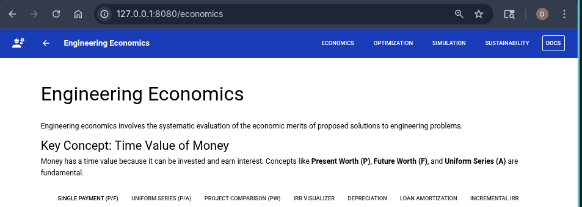
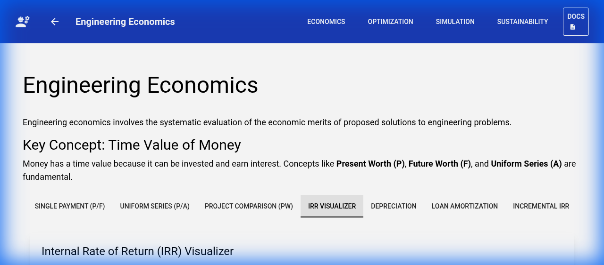
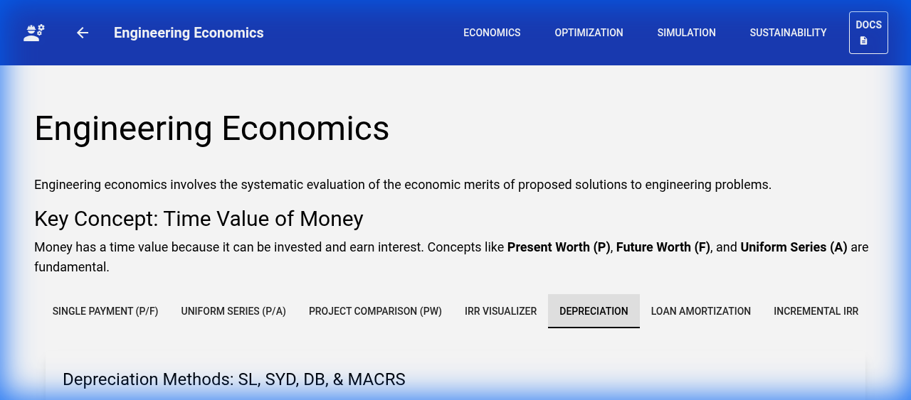
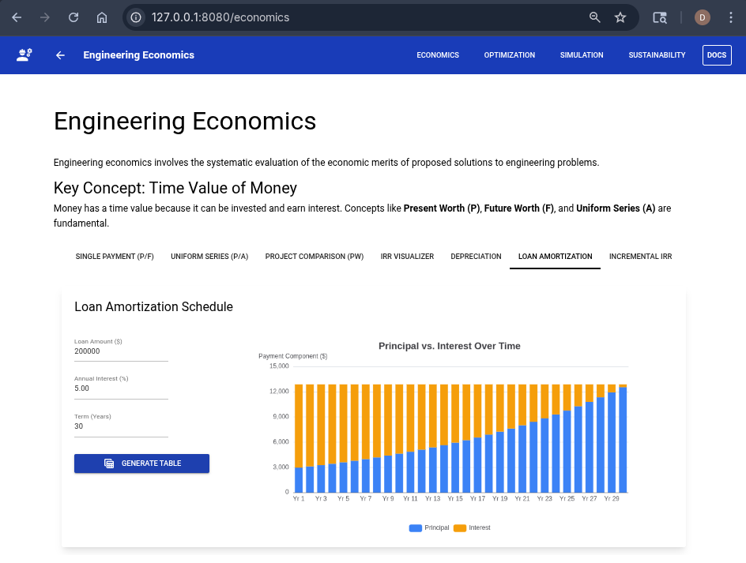

# Engineering Economics

This module focuses on the **Time Value of Money (TVM)**, a foundational concept in Civil Engineering project management and evaluation.

## 1. Single Payment (P/F)
Computes the Future Value ($F$) from a Present Value ($P$) given an interest rate ($i$) and period ($n$).
- **Formula**: $F = P(1+i)^n$
- **What-If Analysis**: Use the **"Save Current as Base"** button to overlay a secondary dashed line on the chart. This allows you to compare how different interest rates affect growth over time.

## 2. Uniform Series (P/A)
 Determines the equivalent present worth of a series of equal annual payments ($A$).
- **Formula**: $P = A \times \frac{(1+i)^n - 1}{i(1+i)^n}$
- **Visualization**: The bar chart shows the cumulative present worth as the investment period extends.

### Project Evaluation Metrics
- **PW Analysis**: Compare net present worth of competing projects.

- **IRR**: Find the internal rate of return using binary search on the NPV curve.
- **Incremental IRR**: Analyze the difference between two projects ($\Delta CF = CF_B - CF_A$) to justify additional investment. If the incremental IRR is greater than the MARR, the more expensive project is preferred.

### Additional Tools
- **Loan Amortization**: Visualize the breakdown of interest vs. principal payments over the life of a loan. This illustrates how high-interest early payments transition to principal recovery.
- **Depreciation Comparator**: Compare SL, SYD, and MACRS methods side-by-side.

## 3. IRR Visualizer
The **Internal Rate of Return (IRR)** is the discount rate ($i$) that satisfies the equation $NPV = 0$.
- **Interpretation**: If the IRR is higher than your Minimum Attractive Rate of Return (MARR), the project is generally considered economically viable.
- **Root-Finding**: Moving the sliders updates the NPV curve. The point where the blue line intersects the dashed black line is the IRR.

Compares capital recovery methods.
- **Straight-Line (SL)**: Equal depreciation each year.
- **MACRS**: An accelerated method used for tax purposes in the US.
- **SYD**: Sum-of-Years' Digits, another accelerated method.
- **Insight**: Check the chart to see how accelerated methods provide larger tax shields in the earlier years of an asset's life.

### Loan Amortization
Visualize the breakdown of interest vs. principal payments over the life of a loan. This illustrates how high-interest early payments transition to principal recovery.

