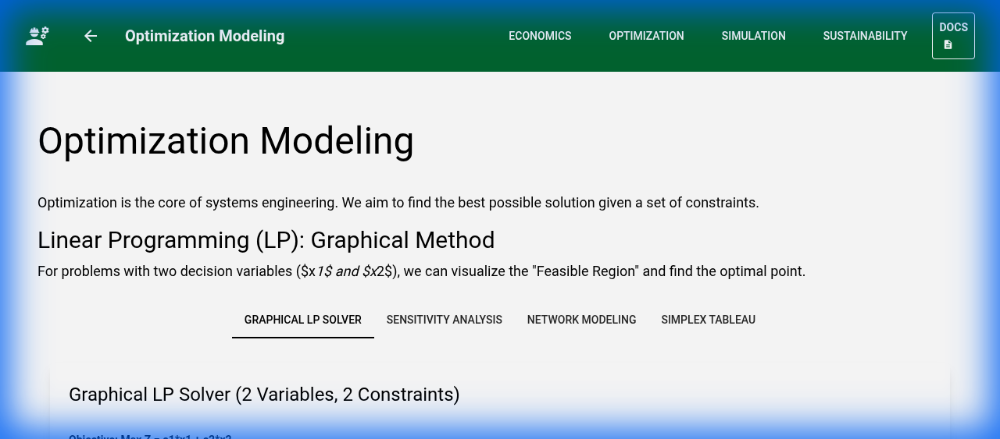
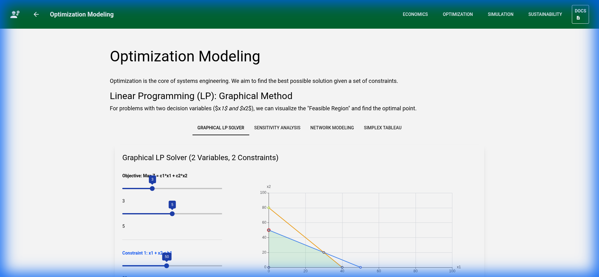
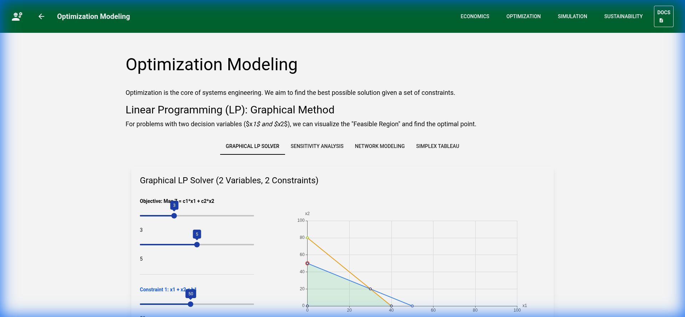
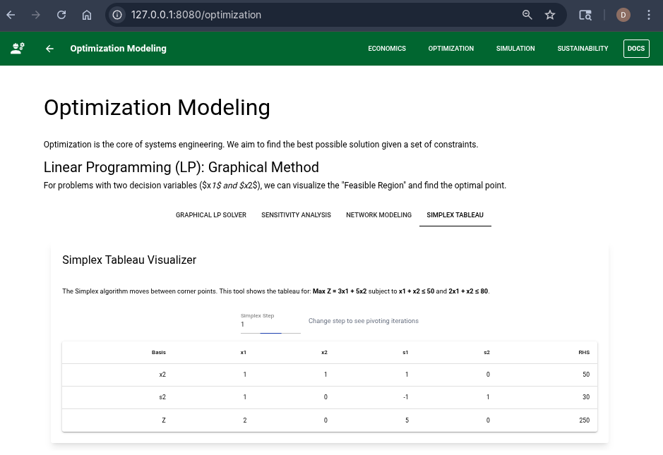

# Optimization Modeling

Solving complex engineering decisions by maximizing or minimizing objective functions subject to constraints.

## 1. Graphical LP Solver
Designed for 2-variable problems ($x_1, x_2$).
- **Feasible Region**: The green shaded area represents all points $(x_1, x_2)$ that satisfy all constraints simultaneously.
- **Optimal Point**: Identified by the red dot. It typically occurs at a "corner point" of the feasible region.
- **Interaction**: Adjust coefficients $c_1, c_2$ to see how the slope of the objective function (the optimization direction) changes the optimal result.

## 2. Sensitivity Analysis (Shadow Prices)
How stable is our solution?
- **Trend Chart**: Shows how the maximum profit ($Z$) changes as you increase a resource limit ($b_1$).
- **Shadow Price**: The marginal value of an additional unit of resource. If the Shadow Price of $b_1$ is 2.0, adding 1 unit to the limit increases your objective value by 2.0.

## 3. Network Modeling
- **Shortest Path**: Using Dijkstra's algorithm.
- **CPM (Critical Path Method)**: Identify critical activities, calculate ES, LS, and Slack.
- **Nodes & Links**: Represents intersections and roads, or routers and cables.
- **Dijkstra's Algorithm**: The "Find Shortest Path" button runs Dijkstra's algorithm to compute the most efficient route from Node A to Node F.
- **Visualization**: The optimal path is highlighted in **red**.

### Pedagogical Tools
- **Simplex Tableau Visualizer**: Step-by-step pivoting demonstration for linear programming.

